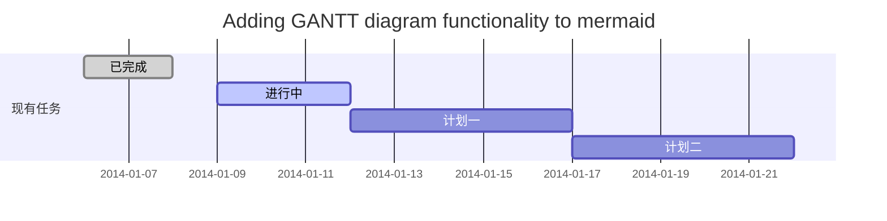
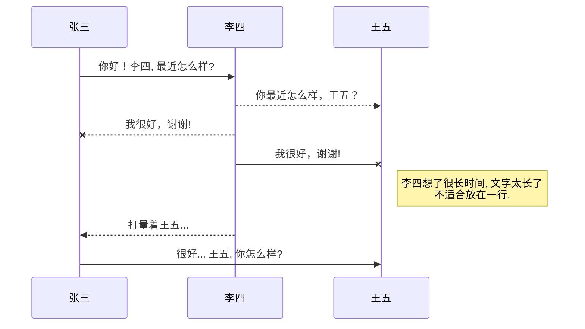
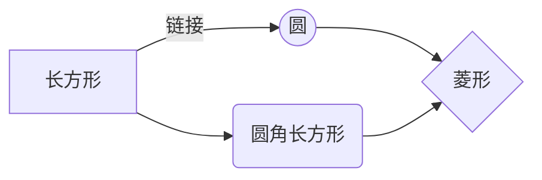

@[页面布局]

# 1.负边距与浮动布局
## 1.1负边距
所谓的负边距就是margin取负值的情况，如margin:-100px，margin:-100%。当一个元素与另一个元素margin取负值时将拉近距离。常见的功能如下：
**向上移动**
当多个元素同时从标准流中脱离开来时，如果前一个元素的宽度为100%宽度，后面的元素通过负边距可以实现上移。当负的边距超过自身的宽度将上移，只要没有超过自身宽度就不会上移。
margin-left:-30%时运行效果：

margin-left:-100%时运行效果：

margin-left:-29%时运行效果：


**去除列表有边框**
下面的效果中右边多出了20px的距离，底下多出20px空白：


解决：


**负边距+定位实现水平垂直居中**


**去除列表最后一个li元素的border-bottom**

底部最后1px问题：


解决：


# 2.三栏式布局
## 2.1 圣杯布局
布局要求：
1. 三列布局，中间宽度自适应，两边定宽；
2. 中间栏要在浏览器中优先展示渲染；
3. 允许任意列的高度最高；
4. 要求只用一个额外的DIV标签；
5. 要求用最简单的CSS、最少的HACK语句；
详情见另一篇博客《三栏布局》

附上代码:
```html
<!DOCTYPE html>
<html>
<head>
    <meta charset="utf-8">
    <title>圣杯布局</title>
    <style type="text/css">
        *{margin: 0;padding: 0;}
        body{min-width: 700px;}
        .header,
        .footer{
            border: 1px solid #333;
            background: #aaa;
            text-align: center;
        }
        .left,
        .main,
        .right{
            position: relative;
            float: left;
            min-height: 130px;
        }
        .container{
            border: 2px solid yellow;
            padding:0 220px 0 200px;
            overflow: hidden;
        }
        .left{
            margin-left: -100%;
            left: -200px;
            width: 200px;
            background: red;
        }
        .right{
            margin-left: -220px;
            right: -220px;
            width: 220px;
            background: green;
        }
        .main{
            width: 100%;
            background: blue;
        }
        .footer{
            clear: both;
        }
    </style>
</head>
<body>
    <div class="header">header</div>
    <div class="container">
        <div class="main">main</div>
        <div class="left">left</div>
        <div class="right">right</div>
    </div>
    <div class="footer">footer</div>
</body>
</html>
```

# 3.弹性布局
# 4.流式布局
# 5.瀑布流布局
# 7.响应式布局
# 8.REM实现响应式布局

你好！ 这是你第一次使用 **Markdown编辑器** 所展示的欢迎页。如果你想学习如何使用Markdown编辑器, 可以仔细阅读这篇文章，了解一下Markdown的基本语法知识。

## 新的改变

我们对Markdown编辑器进行了一些功能拓展与语法支持，除了标准的Markdown编辑器功能，我们增加了如下几点新功能，帮助你用它写博客：

 1. **全新的界面设计** ，将会带来全新的写作体验；
 2. 在创作中心设置你喜爱的代码高亮样式，Markdown **将代码片显示选择的高亮样式** 进行展示；
 3. 增加了 **图片拖拽** 功能，你可以将本地的图片直接拖拽到编辑区域直接展示；
 4. 全新的 **KaTeX数学公式** 语法；
 5. 增加了支持**甘特图的mermaid语法[^1]** 功能；
 6. 增加了 **多屏幕编辑** Markdown文章功能；
 7. 增加了 **焦点写作模式、预览模式、简洁写作模式、左右区域同步滚轮设置** 等功能，功能按钮位于编辑区域与预览区域中间；
 8. 增加了 **检查列表** 功能。
 [^1]: [mermaid语法说明](https://mermaidjs.github.io/)

## 功能快捷键

撤销：<kbd>Ctrl/Command</kbd> + <kbd>Z</kbd>
重做：<kbd>Ctrl/Command</kbd> + <kbd>Y</kbd>
加粗：<kbd>Ctrl/Command</kbd> + <kbd>B</kbd>
斜体：<kbd>Ctrl/Command</kbd> + <kbd>I</kbd>
标题：<kbd>Ctrl/Command</kbd> + <kbd>Shift</kbd> + <kbd>H</kbd>
无序列表：<kbd>Ctrl/Command</kbd> + <kbd>Shift</kbd> + <kbd>U</kbd>
有序列表：<kbd>Ctrl/Command</kbd> + <kbd>Shift</kbd> + <kbd>O</kbd>
检查列表：<kbd>Ctrl/Command</kbd> + <kbd>Shift</kbd> + <kbd>C</kbd>
插入代码：<kbd>Ctrl/Command</kbd> + <kbd>Shift</kbd> + <kbd>K</kbd>
插入链接：<kbd>Ctrl/Command</kbd> + <kbd>Shift</kbd> + <kbd>L</kbd>
插入图片：<kbd>Ctrl/Command</kbd> + <kbd>Shift</kbd> + <kbd>G</kbd>


## 合理的创建标题，有助于目录的生成

直接输入1次<kbd>#</kbd>，并按下<kbd>space</kbd>后，将生成1级标题。
输入2次<kbd>#</kbd>，并按下<kbd>space</kbd>后，将生成2级标题。
以此类推，我们支持6级标题。有助于使用`TOC`语法后生成一个完美的目录。


## 如何改变文本的样式

*强调文本* _强调文本_

**加粗文本** __加粗文本__

==标记文本==

~~删除文本~~

> 引用文本

H~2~O is是液体。

2^10^ 运算结果是 1024.


## 插入链接与图片

链接: [link](https://mp.csdn.net).

图片: 

带尺寸的图片: 

居中的图片: 

居中并且带尺寸的图片: 

当然，我们为了让用户更加便捷，我们增加了图片拖拽功能。


## 如何插入一段漂亮的代码片

去[博客设置](https://mp.csdn.net/configure)页面，选择一款你喜欢的代码片高亮样式，下面展示同样高亮的 `代码片`.
```javascript
// An highlighted block
var foo = 'bar';
```


## 生成一个适合你的列表

- 项目
  - 项目
    - 项目

1. 项目1
2. 项目2
3. 项目3

- [ ] 计划任务
- [x] 完成任务


## 创建一个表格
一个简单的表格是这么创建的：
项目     | Value
-------- | -----
电脑  | $1600
手机  | $12
导管  | $1

### 设定内容居中、居左、居右
使用`:---------:`居中
使用`:----------`居左
使用`----------:`居右
| 第一列       | 第二列         | 第三列        |
|:-----------:| -------------:|:-------------|
| 第一列文本居中 | 第二列文本居右  | 第三列文本居左 |


### SmartyPants
SmartyPants将ASCII标点字符转换为“智能”印刷标点HTML实体。例如：
|    TYPE   |ASCII                          |HTML                         
|----------------|-------------------------------|-----------------------------|
|Single backticks|`'Isn't this fun?'`            |'Isn't this fun?'            |
|Quotes          |`"Isn't this fun?"`            |"Isn't this fun?"            |
|Dashes          |`-- is en-dash, --- is em-dash`|-- is en-dash, --- is em-dash|


## 创建一个自定义列表
Markdown
:  Text-to-HTML conversion tool

Authors
:  John
:  Luke


## 如何创建一个注脚

一个具有注脚的文本。[^2]

[^2]: 注脚的解释


##  注释也是必不可少的

Markdown将文本转换为 HTML。

*[HTML]:   超文本标记语言


## KaTeX数学公式

您可以使用渲染LaTeX数学表达式 [KaTeX](https://khan.github.io/KaTeX/):

Gamma公式展示 $\Gamma(n) = (n-1)!\quad\forall
n\in\mathbb N$ 是通过欧拉积分

$$
\Gamma(z) = \int_0^\infty t^{z-1}e^{-t}dt\,.
$$

> 你可以找到更多关于的信息 **LaTeX** 数学表达式[here][1].


## 新的甘特图功能，丰富你的文章


- 关于 **甘特图** 语法，参考 [这儿][2],

## UML 图表

可以使用UML图表进行渲染。 [Mermaid](https://mermaidjs.github.io/). 例如下面产生的一个序列图：:



这将产生一个流程图。:



- 关于 **Mermaid** 语法，参考 [这儿][3],

## FLowchart流程图

我们依旧会支持flowchart的流程图：
```mermaid
flowchat
st=>start: 开始
e=>end: 结束
op=>operation: 我的操作
cond=>condition: 确认？

st->op->cond
cond(yes)->e
cond(no)->op
```

- 关于 **Flowchart流程图** 语法，参考 [这儿][4].


## 导出与导入

###  导出
如果你想尝试使用此编辑器, 你可以在此篇文章任意编辑。当你完成了一篇文章的写作, 在上方工具栏找到 **文章导出** ，生成一个.md文件或者.html文件进行本地保存。

### 导入
如果你想加载一篇你写过的.md文件或者.html文件，在上方工具栏可以选择导入功能进行对应扩展名的文件导入，
继续你的创作。

 [1]: http://meta.math.stackexchange.com/questions/5020/mathjax-basic-tutorial-and-quick-reference
 [2]: https://mermaidjs.github.io/
 [3]: https://mermaidjs.github.io/
 [4]: http://adrai.github.io/flowchart.js/
